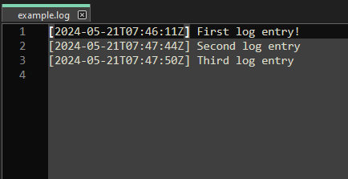

# cmdlog

cmdlog is an application to update log files with automatic timestamping with 
UTC ISO time format

```shell
$ cmdlog example.log "First log entry!"
$ cmdlog example.log "Second log entry!"
$ cmdlog example.log "Third log entry!" 
```



### Building

Just run the command

```shell
$ gcc cmdlog.c -o cmdlog.exe
```
